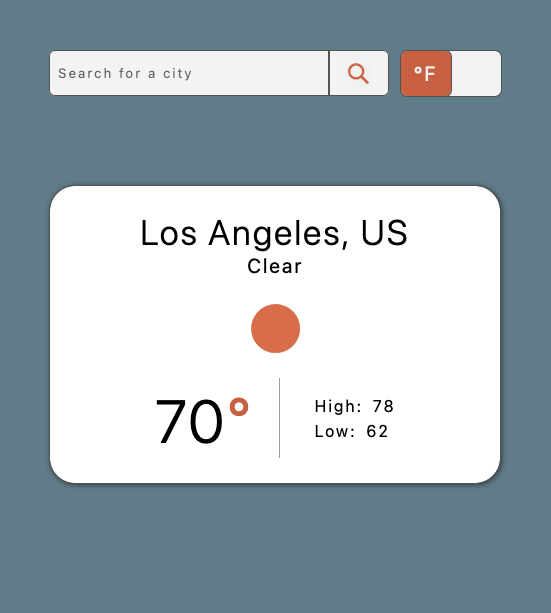
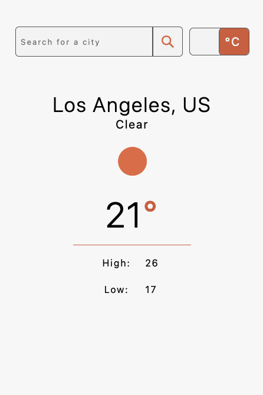

# Weather App
Weather application displaying basic forecast. API data pulled from [Open Weather Map](https://openweathermap.org/).\
Displays weather information based on geographical location or by city search.\  
assignment from [The Odin Project](https://www.theodinproject.com/paths/full-stack-javascript/courses/javascript/lessons/weather-app).\
[Live Preview]()

## Technologies/Tools
Project is created with:
* HTML
* CSS
* JavaScript
* Visial Studio Code
